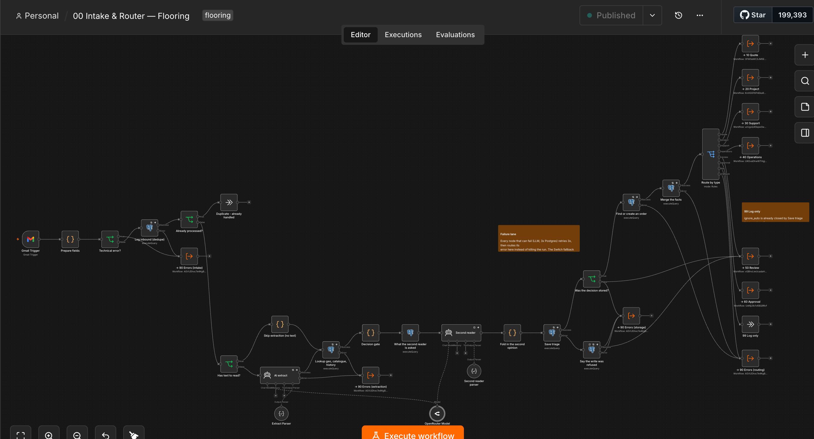
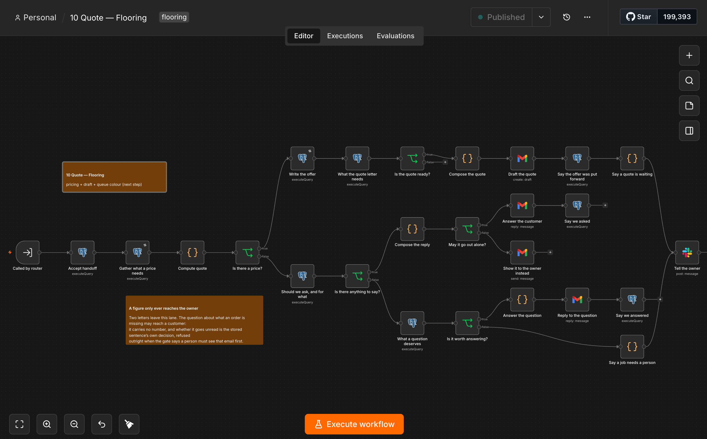
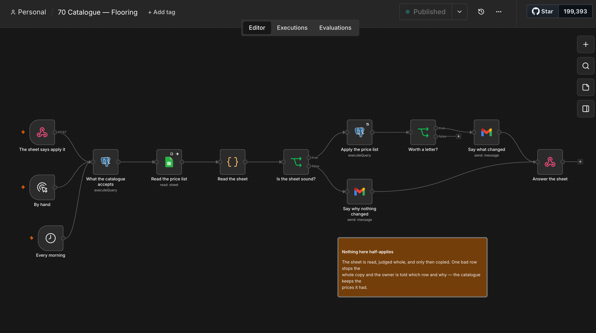

# A deterministic business on a non-deterministic component

This repository shows one way to build a business process around an LLM without making the model
the source of truth.

    The model may suggest.
    The code may decide.
    The database may forbid.
    A person may commit.

The model reads letters and proposes facts. It does not decide the category of an enquiry, does not
work out a price, does not choose a route, and does not send anything to a customer.

The system calls the model twice. The first time, to extract facts. The second reader receives a
decision **the code has already made and cannot rewrite**, and can only raise a flag saying a person
is needed. It
cannot lower one: the flag can only be set, and no branch knows how to clear it.

That puts a designed ceiling on what a mistake by the model can cost: extra work for a person, never
a commitment made to a customer in the firm's name.

The implementation uses a fictional service business. The domain does not matter: the same decisions
apply to any process that begins with unstructured text and ends with work done.

---

# What the system does

It carries an enquiry from the customer's first letter to a visit that is ready to be driven to.

```
Email
  ↓
the letter is recorded         ← written before anything is decided
  ↓
facts extracted (LLM)          ← each fact with a quotation from the letter
  ↓
the quotations are checked     ← anything unverified is dropped
  ↓
classification and routing     ← deterministic rules
  ↓
the job's state is updated     ← facts accumulate across the whole correspondence
  ↓
actions
   • answering a question
   • preparing a price for approval
   • matching a booking to a job
   • creating documents
   • briefing whoever drives out
```

A person steps in only where an action creates a **financial obligation** to the customer.

---

# Architecture

| Layer | Responsible for |
|---|---|
| LLM | extracting facts, and a second check |
| JavaScript | business decisions |
| SQL | invariants and state transitions |
| PostgreSQL | state, the single source of truth |
| n8n | orchestration |

**No layer can stand in for another:** the model makes no business decisions, n8n holds no business
rules, the database knows nothing about external services.



*Lane 00 — Intake & Router. The model proposes facts; `Decision gate` — ordinary code — decides which
of them may enter the process, and `Route by type` sorts the letter into a lane. Three of the twelve
lanes.*

There is no business logic in the workflows. Every JavaScript node and every SQL statement exists as
a file of its own in the repository; a check **refuses** when a file has drifted from what is inside
n8n. The visual editor is not the source of truth.

Decisions and invariants are verified **without n8n running**: the code is executed directly, and
the SQL is run against a real PostgreSQL.

**What is actually checked**

- business rules and routing;
- transitions between the states of a job, a visit and an offer;
- the database's invariants — impossible states are refused by PostgreSQL, not by the code;
- the joins to Gmail, Slack, Google Calendar and Docs;
- idempotency: a second run does not create a second document, letter or record;
- negative cases: somebody else's booking code, an address outside the service area, an empty letter;
- behaviour under failure: an interrupted run, an unreachable external service, a concurrent write;
- the model's edge cases — a quotation cut short, a unit in the wrong place, an invented fact.

---

# How it is verified

I treat a check as working only after I have **seen it fail**. First I break what it guards, look at
the specific error, restore it — and only then write it down as evidence.

One of the checks gave a false positive three runs in a row: the test read the timestamp straight
out of PostgreSQL, while the real path of the data went through JSON and lost precision. Since then
checks are built through the real path of the data.

Hence the second rule: code I did not write does not enter the repository until I have run it on
inputs its author did not choose. Tests written alongside code share its assumptions and pass even
when the assumption is wrong.

---

# The boundary of autonomy

The system acts on its own wherever an action **can be taken back**. Where an action creates an
obligation to the customer, a person acts. That is the only criterion — not the difficulty of the
step, and not anything the system "cannot do".

| Step | Who acts | Why |
|---|---|---|
| answer whether the firm does this kind of work | the system | the next letter corrects a mistake |
| ask for what is missing before a price | the system | a question promises nothing |
| refuse somebody outside the service area | the system | a refusal creates no obligation |
| **send a price to the customer** | **a person** | a figure becomes a promise that has to be kept |
| accept a booking | the system | the customer picks the time; the system only matches it to a job |
| **let a visit go ahead at an address that was never in the letter** | **a person** | the price was worked out for a different town |
| confirm the visit to the customer | the system | it confirms something that has already happened |
| prepare the agreement | the system | a document with no price on it, filled from the database |
| **name the final cost** | **a person** | it is named on site, after measuring |

The criterion is not how hard the step is, but whether the cost of getting it wrong leaves the
system. The system works out the price itself and composes the whole letter; what it does not have
is the right to send it. It accepts a booking automatically, but where the address is in a different
town from the one the price was worked out for, it holds the confirmation until a person has looked.



*Lane 10 — Quote. The upper branch ends at `Draft the quote`: the letter is composed in full and left
in the owner's drafts. The lower branch asks the customer for what is missing, or answers a question
about what the firm does.*

The difference between "cannot" and "may not" is what is being designed here: the first is removed
by code, the second is left in on purpose.

---

# Why n8n

**Orchestration is delegated to n8n; business logic is not.** Webhooks, retries, timeouts, a
scheduler, OAuth to five APIs — none of that distinguishes this business from any other.

There is no separate admin system either: the business already works in Gmail, Sheets and Calendar.

The cost: n8n becomes a dependency and a single point of failure. The insurance is that no business
logic lives in it.

---

# Reports

Two separate sets are planned, for two different readers.

**Operational** — new enquiries, conversion from letter to visit, live offers with no answer,
scheduled visits.

**Technical** — stalled processes, rejected facts, corrections made by a person, delays between
stages.

When they are built they will read the operational database rather than a store of their own. As
load grows the next step is a read replica, not a duplicate of the business state.

---

# Where the system stops

The system's work ends once a visit is prepared. The final cost, the invoice and the payment belong
to another system.

The price given from a letter is an **orientation**: nobody has seen the property yet. The final one
is named on site by whoever is standing there, on a document that already carries the job's code.

That code is the join. Every job is given one when it is created — five letters and two digits, no
separator, in a shape somebody can copy off a screen into somebody else's form without losing it.
The booking page asks for exactly that code, and the system matches a calendar event to a job by it.

The same code puts the accounting **outside this system**. Invoices, payments and tax live where
they belong — in an accounting service — and are joined to a job by one lookup on the code. Neither
amounts paid nor payment details are stored here: the system knows that job 16 has the code
`APQAX75`, and there its responsibility ends. Duplicating financial records in its own database
would mean keeping a second copy of something that already has an owner, and drifting from it.

---

# What it takes to run this

This is not "clone it and run it". The system depends on ten external components, and without them
nothing starts.

| What | What for | Where it is used |
|---|---|---|
| **PostgreSQL** | all state: jobs, letters, offers, visits | 14 lanes |
| **n8n**, self-hosted | orchestration; lanes are deployed through its API | all of them |
| **a server for n8n** | Hetzner, Docker; not the hosted n8n | — |
| **Gmail** (OAuth) | reading mail, writing drafts, sending letters | 8 lanes |
| **Slack** (bot token) | what the owner sees | 4 lanes |
| **Google Calendar** | the booking page and the trigger on a new event | the visits lane |
| **Google Docs** | the agreement template that gets copied | the visits lane |
| **Google Drive** | where the copies of agreements live | the visits lane |
| **Google Sheets** | the price list the owner keeps | the catalogue lane |
| **any LLM** | extracts facts from a letter; reached through a gateway, so it is changed by configuration | the intake lane |



*Lane 70 — Catalogue. Three ways in on the left — a schedule, a button inside the sheet, and by hand
— meeting one chain. The sheet is judged as a whole before anything is applied: one bad row stops
the transfer.*

Four Slack channels, named after what the person has to do rather than after where the message came
from:

```
#drafts           a price is written — read it and send it
#needs-a-person   the desk has no right to act on its own
#going-out        where to drive and what to bring
#desk-health      whether the system is alive: the morning digest, "mail has been quiet for N hours"
```

The last one is built differently from the rest: in it, **silence is itself the signal**. The digest
arrives every morning even when there is nothing in it — so a morning without one means something
has stopped. In a channel where things appear only when there is news, a message that never came is
invisible.

Environment variables are in `.env.example`:

```
N8N_BASE_URL, N8N_API_KEY     deploying the lanes
DATABASE_URL                  the database the state lives in
CHECK_DATABASE_URL            a disposable database for local runs
```

n8n runs **on a server of its own** (Hetzner, Docker) rather than on a hosted plan: lanes are
deployed to it through the API, and the credentials for Google, Gmail and Slack stay on that machine
rather than in somebody else's account.

The checks on logic and SQL run **without n8n and without any of the Google services** — they need
only PostgreSQL. Everything else has to be connected for real, and it is on those joins that the
system has most often broken.

---

# Node by node

Everything above is the argument. [`ANATOMY.md`](ANATOMY.md) is the evidence: every node of every
lane, described by what arrives, what it does, what it passes on, **what happens when it fails**, and
what protects against that — and, where nothing does, saying so.

It ends with the twenty-odd places that have no protection, ordered by consequence. That section is
the reason the document exists; the rest is how those were found.

---

# Repository layout

```
src/         business decisions, one file per node
db/          schema, invariants, SQL, migrations
tests/       checks on logic, with no database
scripts/     integration runs against PostgreSQL
workflows/   the exported n8n workflows
media/       the three canvases shown above
```
